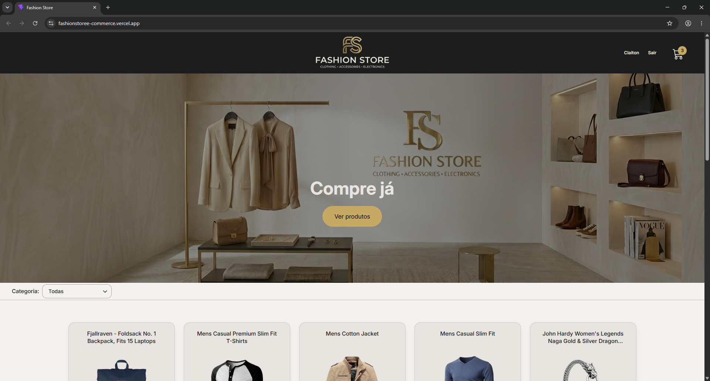
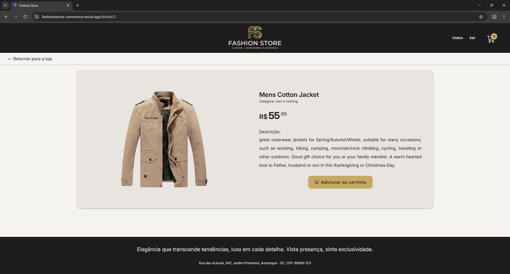
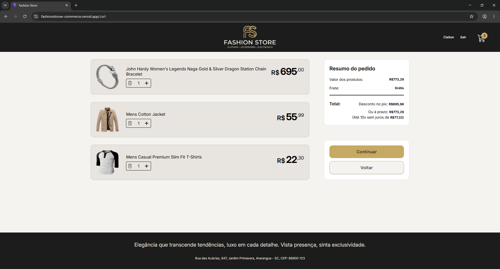
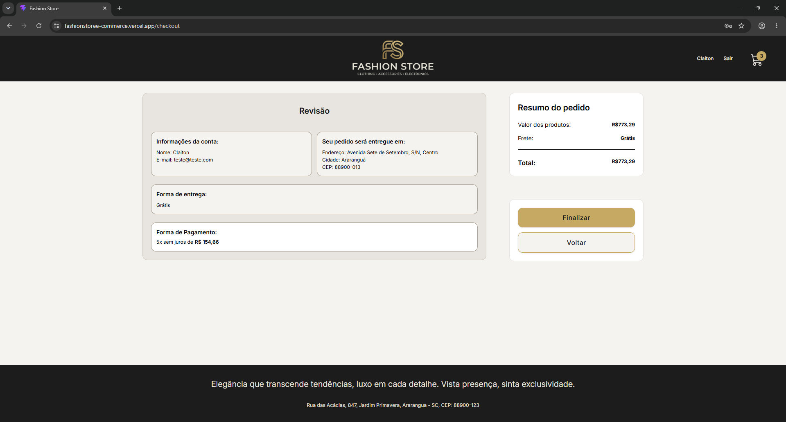
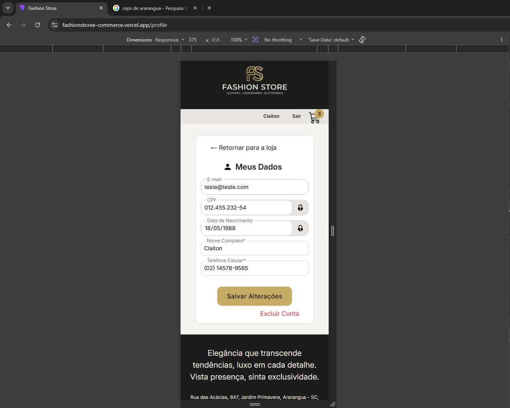

# 🛍️ Fashion Store — E-commerce de Moda com React

E-commerce desenvolvido com React, simulando uma loja virtual completa, desde a navegação e filtragem de produtos até o carrinho, cadastro de usuários e fluxo de checkout.

O projeto foi desenvolvido com foco em praticar conceitos fundamentais e avançados de desenvolvimento Front-End utilizando React.

## 🚀 Demonstração

🔗 [Acessar o Fashion Store](https://fashionstoree-commerce.vercel.app/)

🔗 [Repositório no GitHub](https://github.com/Claitonjc/FashionStore---E-commerce-de-Moda-com-React)

---

## 📸 Preview

### 🏠 Home



### 🛍️ Detalhes do produto



### 🛒 Carrinho



### 💳 Checkout



### 📱 Responsividade



---

## ✨ Funcionalidades

### 🛒 Produtos

- Listagem de produtos
- Filtro de produtos por categoria
- Página de detalhes do produto
- Integração com API externa
- Estados de carregamento
- Tratamento de erros

### 👤 Usuários

- Cadastro de usuário
- Login
- Logout
- Edição dos dados do perfil
- Exclusão de conta
- Recuperação de senha simulada

### 🛍️ Carrinho

- Adição de produtos
- Controle de quantidade
- Remoção de produtos
- Cálculo automático do subtotal
- Carrinho individual por usuário
- Persistência dos dados utilizando LocalStorage

### 📦 Checkout

- Cadastro e seleção de endereços
- Consulta de endereço através do CEP
- Seleção da forma de entrega
- Cálculo de frete
- Seleção de forma de pagamento
- Pagamento via PIX
- Pagamento via cartão de crédito
- Seleção de parcelas
- Validação do CVV
- Resumo do pedido
- Geração de número do pedido
- Tela de confirmação da compra

### 📱 Interface

- Layout responsivo
- Interface adaptada para dispositivos móveis
- Componentes reutilizáveis
- Feedback visual para diferentes estados da aplicação

---

## 🛠️ Tecnologias

- **React**
- **JavaScript**
- **Vite**
- **Tailwind CSS**
- **React Router DOM**
- **Context API**
- **React Icons**
- **LocalStorage**
- **Fetch API**

### APIs utilizadas

- [Fake Store API](https://fakestoreapi.com/) — produtos e categorias
- [ViaCEP](https://viacep.com.br/) — consulta de endereços através do CEP

---

## 🧠 Conceitos praticados

Durante o desenvolvimento do projeto foram aplicados diversos conceitos importantes do ecossistema React:

- Componentização
- Props
- State
- Hooks
- Custom Hooks
- Context API
- `useState`
- `useEffect`
- `useMemo`
- `useCallback`
- `useRef`
- React Router
- Rotas dinâmicas
- Navegação programática
- Renderização condicional
- Formulários controlados
- Consumo de APIs REST
- Tratamento de erros
- Estados de loading
- Persistência de dados
- LocalStorage
- Memoização
- Responsividade
- Organização e separação de responsabilidades

---

## 📁 Estrutura do projeto

```text
src/
├── assets/
├── components/
├── context/
│   ├── addressContext/
│   ├── cartContext/
│   ├── checkoutContext/
│   └── UsersContext/
├── hooks/
├── pages/
├── routes/
├── service/
└── utils/
```

### Organização

**`components/`**  
Componentes reutilizáveis da interface.

**`context/`**  
Gerenciamento dos estados globais da aplicação através da Context API.

**`hooks/`**  
Hooks personalizados utilizados para reutilizar lógica da aplicação.

**`pages/`**  
Páginas principais da aplicação.

**`routes/`**  
Configuração das rotas utilizando React Router.

**`service/`**  
Serviços responsáveis pela comunicação com APIs externas.

**`utils/`**  
Funções auxiliares, como máscaras de entrada, formatação de preços e cálculo do pedido.

---

## 🔄 Fluxo principal da aplicação

```text
Home
│
├── Produtos
│   └── Detalhes do produto
│
└── Carrinho
    │
    ├── Endereço
    │
    ├── Forma de envio
    │
    ├── Forma de pagamento
    │
    └── Checkout
        │
        └── Compra concluída
```

---

## 💾 Persistência de dados

O projeto utiliza `localStorage` para manter informações entre sessões do navegador.

São armazenados dados como:

- Usuários
- Usuário autenticado
- Carrinhos
- Endereços
- Cartões
- Forma de pagamento
- Forma de envio
- Parcelamento
- Número do pedido

Para facilitar essa persistência, foi desenvolvido um Custom Hook:

```js
useLocalStorage()
```

---

## 📱 Responsividade

A interface foi desenvolvida utilizando Tailwind CSS e adaptada para diferentes tamanhos de tela, incluindo dispositivos móveis, tablets e desktops.

---

## ⚠️ Observação

Este projeto foi desenvolvido para fins de estudo e portfólio.

O sistema de autenticação, armazenamento de usuários e fluxo de pagamento são simulados utilizando `localStorage`. Portanto, não se trata de um sistema de e-commerce pronto para produção.

Nenhum pagamento real é realizado.

---

## 💻 Como executar o projeto

### 1. Clone o repositório

```bash
git clone https://github.com/Claitonjc/FashionStore---E-commerce-de-Moda-com-React.git
```

### 2. Entre na pasta

```bash
cd FashionStore---E-commerce-de-Moda-com-React
```

### 3. Instale as dependências

```bash
npm install
```

### 4. Execute o projeto

```bash
npm run dev
```

A aplicação estará disponível no endereço informado pelo Vite no terminal.

---

## 🌐 Deploy

O projeto foi publicado utilizando a Vercel.

🔗 [**Acessar aplicação**](https://fashionstoree-commerce.vercel.app/)

---

## 👨‍💻 Desenvolvedor

**Claiton José Clemes**

Front-End Developer em formação, com foco em JavaScript, React e desenvolvimento de interfaces web.

🔗 [GitHub](https://github.com/Claitonjc)

🔗 [LinkedIn](https://www.linkedin.com/in/claiton-jose-clemes/)
